|  | System Operasi  |
|--|--|
| NIM |  254107020081|
| Nama |  Muhammad Zainur Roziqin |
| Kelas | TI - 1G |
| Repository | [link] (https://github.com/rozigifhub/SystemOperasi/blob/Rozi/Tugas/Pertemuan2/REPORT.md) |

# Sintak-sintaks Linux

## Praktikum 2.1 - Identifikasi CPU dan Memori

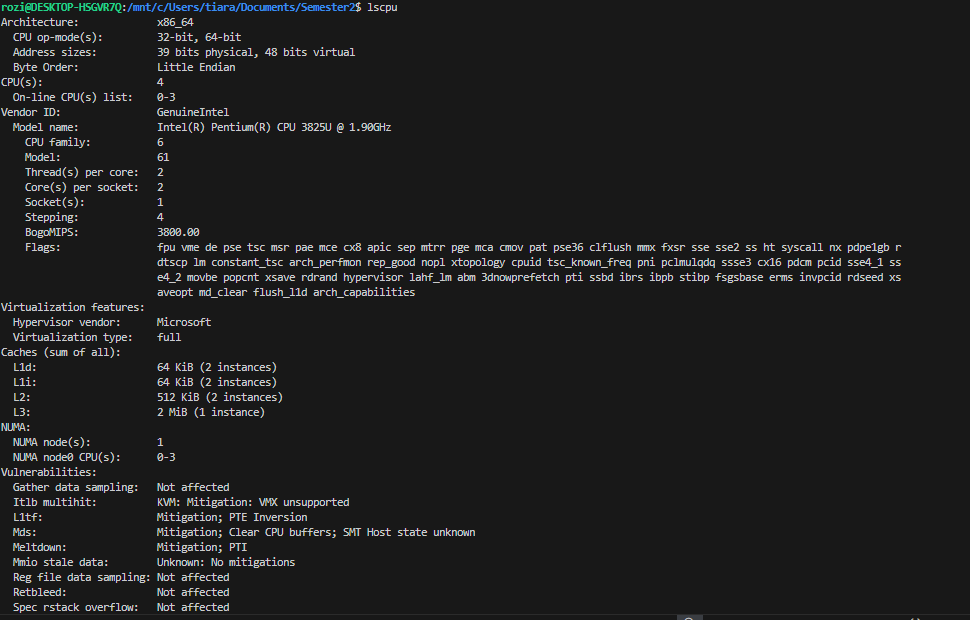

lscpu

Melihat informasi CPU.

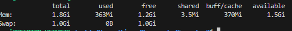

free -h

Melihat penggunaan memori.

## Praktikum 2.2 - Identifikasi Perangkat PCI/USB dan Driver

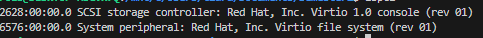

lspci

Melihat daftar PCI.

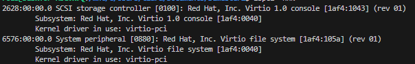

lspci -nnk

Lihat perangkat PCI beserta driver kernel yang digunakan.

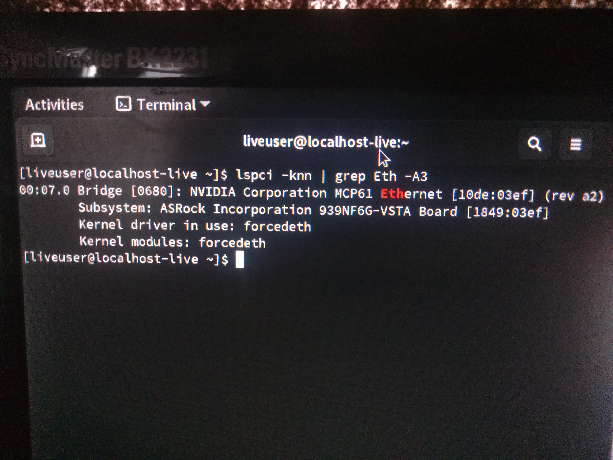

lspci - nnk | grep - A3 -i ethernet

Mencari info NIC dan drivernya

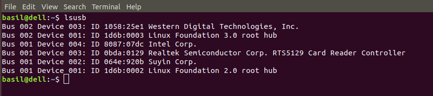

lsusb

Melihat perangkat USB

## Praktikum 2.3 - Identifikasi Storage dan Filesystem

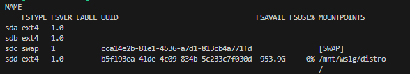

lsblk -f

Melihat daftar disk/partisi

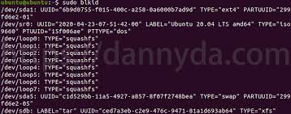

sudo blkid

melihat uuid filesystem

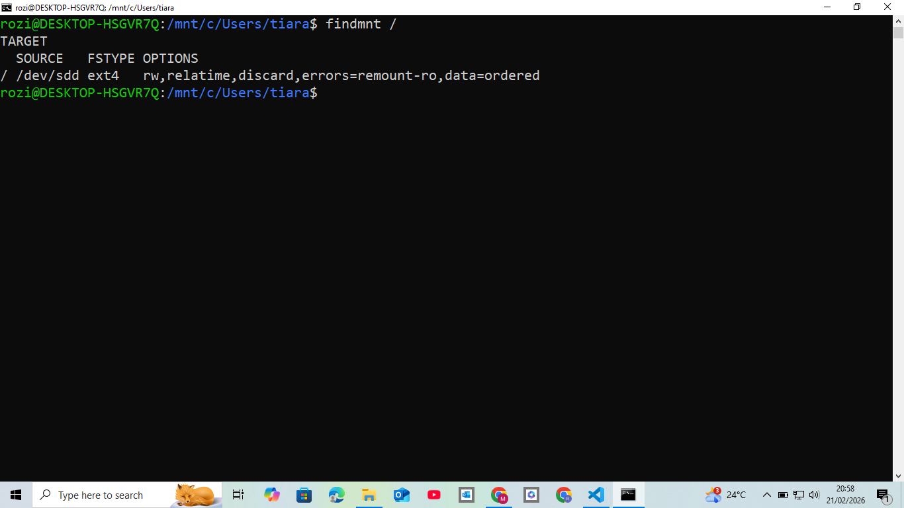

findmnt / 

Lihat mount point untuk root filesystem

## Praktikum 2.4 - Melihat Modul Aktif dan Informasinya

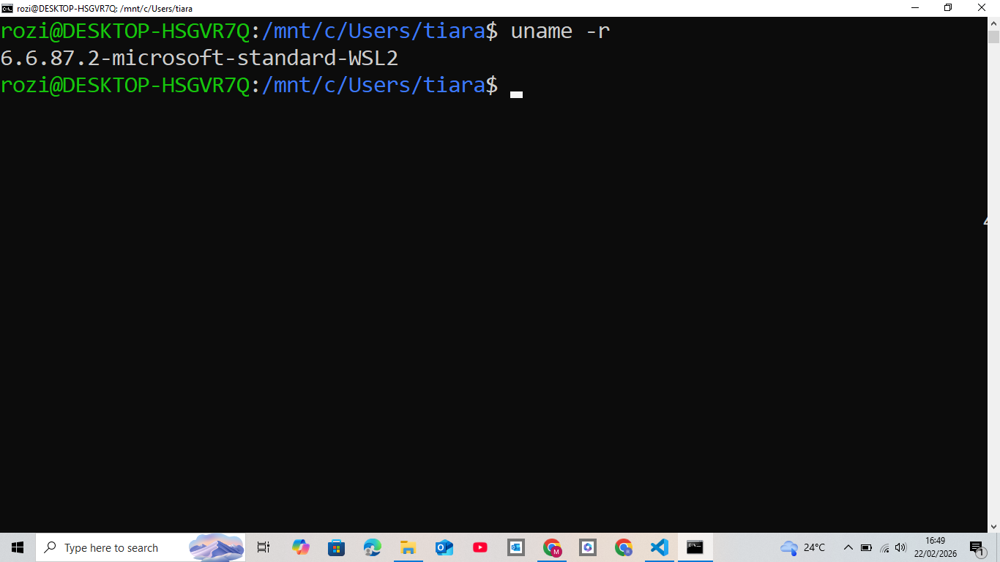

uname -r

mengecek versi kernel

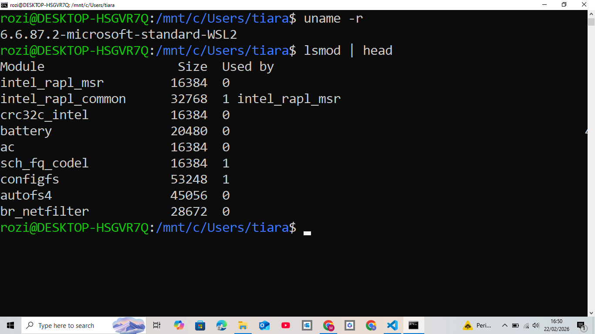

lsmod | head

cek modul yang aktif

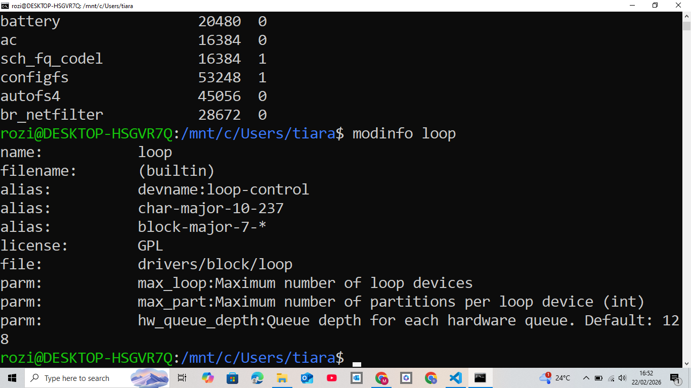

modinfo

cek info modul

sudo modprobe loop
lsmod | grep -i loop

Load modul dan verifikasi

## Praktikum 2.5 - Konfigurasi Auto Load dan Blacklist

echo " loop " | sudo tee / etc / modules - load . d / loop . conf

Menambahkan modul untuk auto-load (demo)

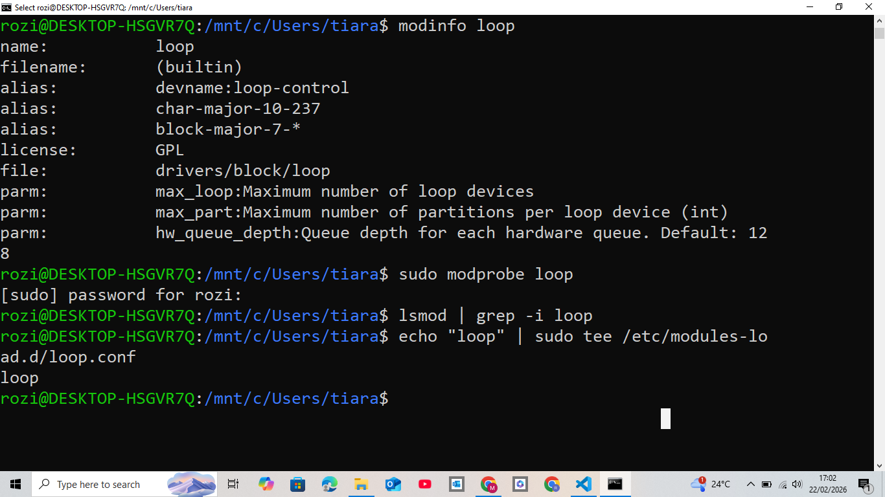

lsmod | grep -i loop

verifikasi modul aktif

## Praktikum 2.6 - Mengenali Block vs Character Device

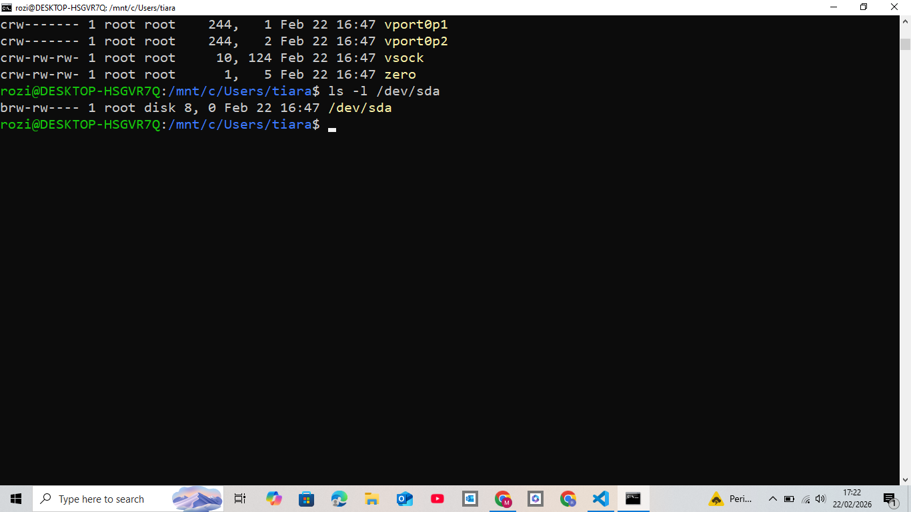

 ls -l / dev / sda

 Melihat detail device node disk

 

 ls -l / dev / tty

 Melihat detail device node disk

 ## Praktikum 2.7 — Melihat Informasi udev

 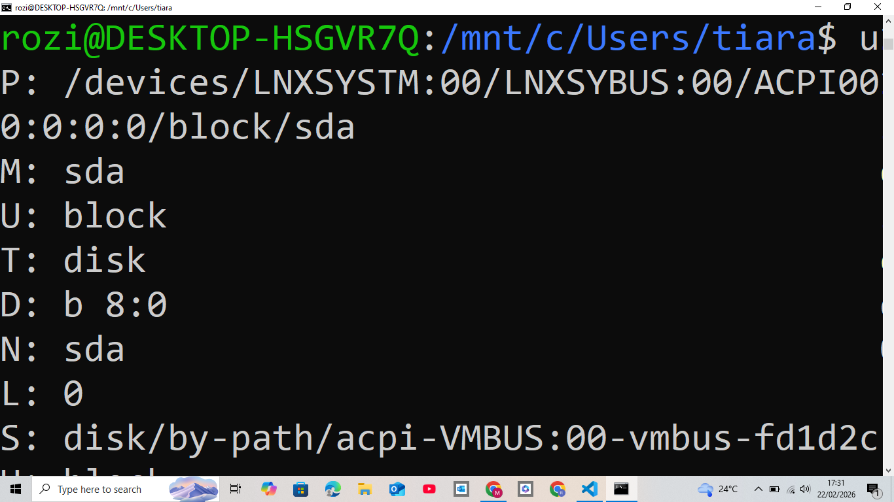

udevadm info -- query = all -- name =/ dev / sda | head -n 30

 Melihat atribut udev untuk disk

## Praktikum 2.8 — Membuat Workspace Praktikum
